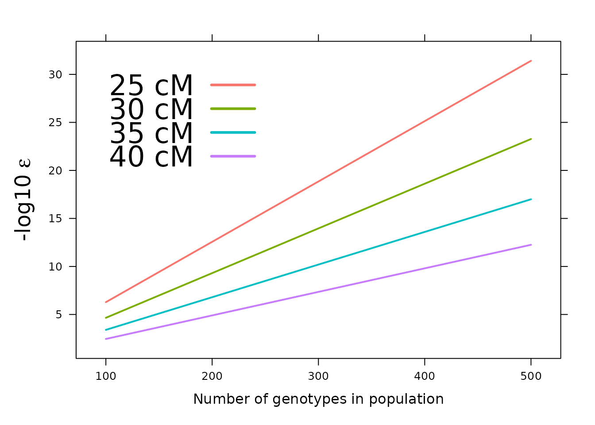
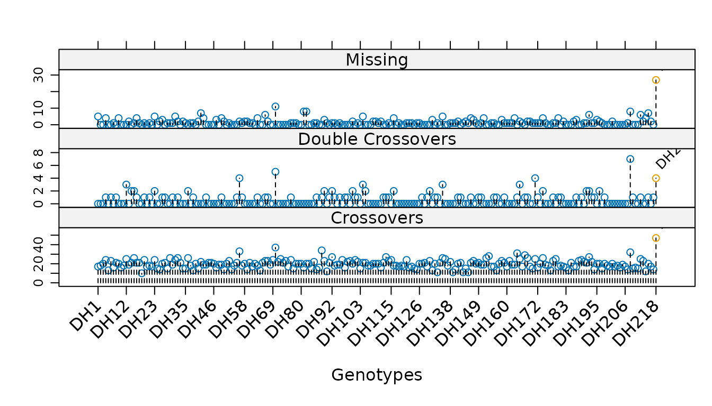
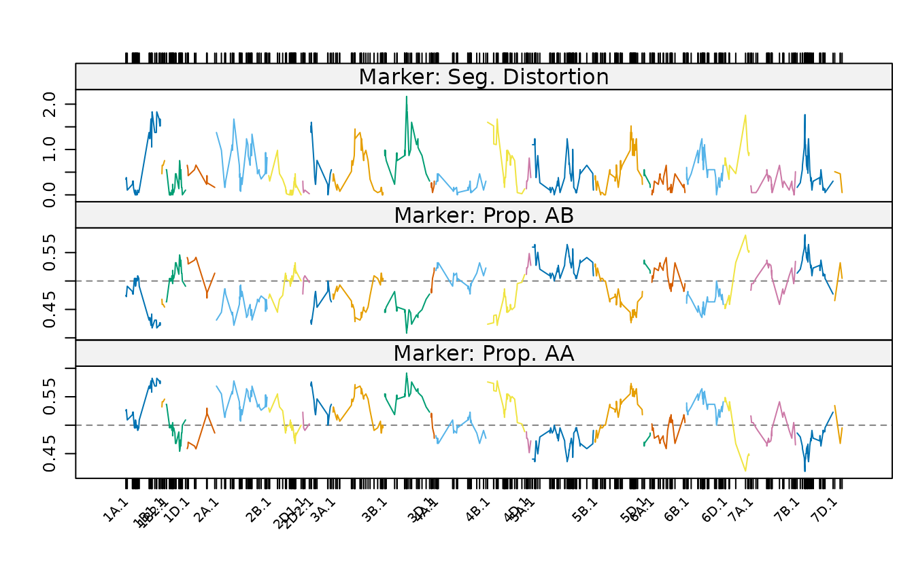
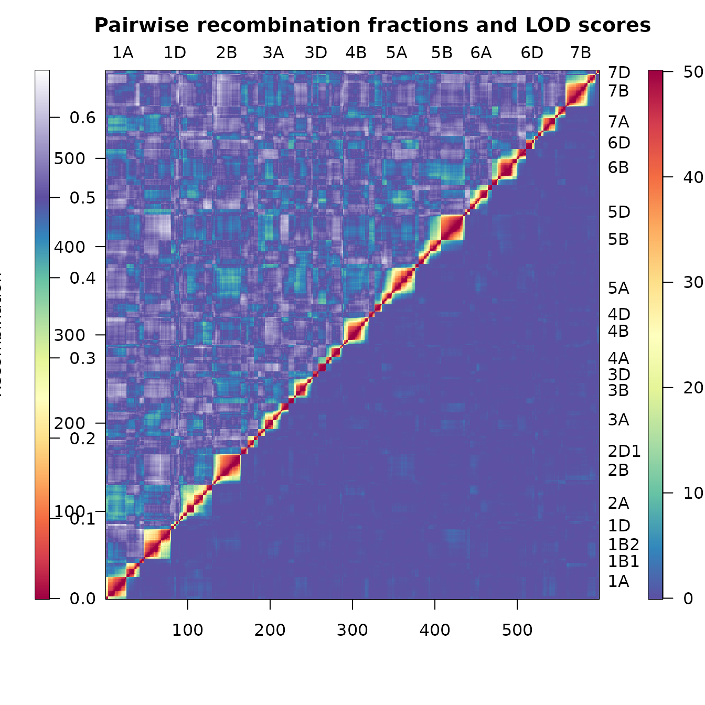

# Linkage map construction with ASMap

This vignette introduces the construction of a linkage map with ASMap,
the arguments that most influence the outcome, and the facilities
provided for assessing the result. It is intended to be read once, in
order, by someone meeting the package for the first time.

> **Scope.** This is a short introduction. Complete documentation — nine
> further articles covering every function, the technical basis of the
> MSTmap algorithm, and a worked example carrying an unconstructed 3,023
> marker barley backcross through to a diagnosed seven linkage group map
> — is published at <https://drj001.github.io/ASMap/> and listed at the
> end of this document. Individual functions are documented in the help
> pages.

Construction is performed by the MSTmap algorithm ([Wu et al.
2008](#ref-mst08)), which clusters markers into linkage groups and
determines an optimal order within each group in a single pass. This
distinguishes it from the two-stage procedures common elsewhere, in
which a non-exhaustive initial ordering is followed by an exhaustive
search within a sliding marker window. The returned object is an R/qtl
`cross` object ([Broman and Wu 2014](#ref-br14)), so the facilities of
that package remain available throughout.

## The package in outline

The functions divide into three stages of a map construction workflow.

| Stage | Functions | Purpose |
|----|----|----|
| Pre-construction | [`statGen()`](https://drj001.github.io/ASMap/reference/statGen.md), [`profileGen()`](https://drj001.github.io/ASMap/reference/profileGen.md), [`genClones()`](https://drj001.github.io/ASMap/reference/genClones.md), [`fixClones()`](https://drj001.github.io/ASMap/reference/fixClones.md), [`statMark()`](https://drj001.github.io/ASMap/reference/statMark.md), [`profileMark()`](https://drj001.github.io/ASMap/reference/profileMark.md), [`pValue()`](https://drj001.github.io/ASMap/reference/pValue.md), [`pullCross()`](https://drj001.github.io/ASMap/reference/pullCross.md) | Diagnose and curate genotypes and markers before a map is built, and set problematic markers aside |
| Construction | [`mstmap()`](https://drj001.github.io/ASMap/reference/mstmap.cross.md) | Cluster markers into linkage groups, order them, and estimate genetic distances |
| Post-construction | [`pushCross()`](https://drj001.github.io/ASMap/reference/pushCross.md), [`heatMap()`](https://drj001.github.io/ASMap/reference/heatMap.md), [`alignCross()`](https://drj001.github.io/ASMap/reference/alignCross.md), [`breakCross()`](https://drj001.github.io/ASMap/reference/breakCross.md), [`mergeCross()`](https://drj001.github.io/ASMap/reference/mergeCross.md), [`combineMap()`](https://drj001.github.io/ASMap/reference/combineMap.md), [`subsetCross()`](https://drj001.github.io/ASMap/reference/subsetCross.md), [`quickEst()`](https://drj001.github.io/ASMap/reference/quickEst.md) | Reintroduce markers, display and interpret the map, and manipulate its structure |

The two pre- and post-construction stages are what distinguish a usable
workflow from a single call to an ordering algorithm. Poor genotypes and
uninformative markers degrade an order, and are more cheaply removed
before construction than diagnosed afterwards.

## Marker data

The package supplies five datasets. `mapDHf` is an unconstructed doubled
haploid wheat marker set, in the layout the construction function
requires: **markers in rows, genotypes in columns**, with marker names
in the `rownames` and genotype names in the `names`.

> The datasets are not lazy-loaded, and therefore require an explicit
> [`data()`](https://rdrr.io/r/utils/data.html) call. Its omission
> results in `object 'mapDHf' not found`.

``` r

data(mapDHf)

dim(mapDHf)
```

    [1] 599 218

``` r

mapDHf[1:5, 1:6]
```

            DH1 DH2 DH3 DH4 DH5 DH6
    5B.m.2    B   B   B   A   A   B
    5A.m.52   B   B   A   A   B   A
    2B.m.1    A   B   A   B   B   A
    6B.m.3    B   B   A   B   A   A
    5A.m.43   B   B   A   B   B   A

## Construction

A single call clusters the markers into linkage groups, orders the
markers within each group, and estimates the genetic distances between
them.

``` r

map <- mstmap(mapDHf, pop.type = "DH", dist.fun = "kosambi", p.value = 1e-06)
```

    Number of linkage groups: 24
    The size of the linkage groups are: 56  54  35  41  4   37  6   30  40  27  37  13  15  10  21  6   32  33  33  41  6   9   5   8   
    The number of bins in each linkage group: 55    53  34  41  3   36  6   29  40  27  36  13  14  9   21  5   32  33  32  41  5   8   4   7   

``` r

nchr(map)
```

    [1] 24

``` r

round(chrlen(map), 1)
```

       L1    L2    L3    L4    L5    L6    L7    L8    L9   L10   L11   L12   L13 
    142.8 181.9  97.4 115.4  21.7 108.2  13.3 133.9 153.2  98.7 145.8  60.4  72.2 
      L14   L15   L16   L17   L18   L19   L20   L21   L22   L23   L24 
     81.2  98.2   8.7 109.5  60.9 134.5 104.0  18.0   7.8   7.8  19.2 

The linkage group summary printed above is emitted by the MSTmap
algorithm itself rather than by R, and appears independently of the
`trace` argument.

``` r

plotMap(map)
```


Where the markers already reside in a `cross` object, the same generic
accepts it directly. Two combinations of arguments recur throughout the
documentation:

``` r

# cluster and order from scratch, disregarding existing linkage groups
mstmap(cross, bychr = FALSE, p.value = 1e-12)

# re-order markers within existing linkage groups, without splitting them
mstmap(cross, bychr = TRUE, p.value = 2)
```

A `p.value` greater than unity suppresses clustering entirely, which is
the mechanism underlying the second of these.

## The choice of `p.value`

The `p.value` argument sets the threshold at which markers are separated
into distinct linkage groups, and is the single argument that most
affects the result. Its appropriate value depends strongly on the size
of the population, larger populations requiring a smaller value. The
relationship may be inspected directly, so that the choice need not be
made by trial alone.

``` r

pValue(dist = c(25, 30, 35, 40), pop.size = 100:500, map.function = "kosambi")
```



For a population of approximately 300 individuals, a `p.value` of
`1e-12` corresponds to a threshold of some 30 cM before two markers are
placed in a common linkage group.

## Diagnosing genotypes

The diagnostic functions operate on a `cross` object, and are therefore
applied either to a map obtained elsewhere or to an existing map that is
about to be reconstructed.
[`statGen()`](https://drj001.github.io/ASMap/reference/statGen.md)
summarises each genotype by its number of crossovers, its number of
double crossovers, and its proportion of missing values.

``` r

data(mapDH)
sg <- statGen(mapDH, bychr = FALSE, stat.type = c("xo", "dxo", "miss"))

range(sg$xo)
```

    [1] 10 47

``` r

sort(sg$dxo, decreasing = TRUE)[1:5]
```

    DH208  DH70  DH56 DH171 DH218 
        7     5     4     4     4 

A double crossover across a short interval is improbable under normal
recombination, so genotypes accumulating them are candidates for
genotyping error. One genotype, `DH208`, carries seven.

[`profileGen()`](https://drj001.github.io/ASMap/reference/profileGen.md)
presents the same statistics graphically, which exposes an isolated
offender more readily than a sorted table does. Supplying an expected
recombination rate to `xo.lambda` marks those genotypes whose crossover
count departs significantly from it.

``` r

profileGen(mapDH, bychr = FALSE, stat.type = c("xo", "dxo", "miss"),
           id = "Genotype", xo.lambda = 25, layout = c(1, 3), lty = 2)
```



A single genotype is flagged here, `DH218`, whose 47 crossovers are the
most in the population and well above the expectation of 25. Derivation
of an appropriate `xo.lambda` for a given population is set out in the
[diagnostics
article](https://drj001.github.io/ASMap/articles/diagnostics.html).

> [`profileGen()`](https://drj001.github.io/ASMap/reference/profileGen.md)
> returns its statistics invisibly, including a logical vector named
> `xo.lambda` that marks the genotypes it has flagged. This pairs
> directly with
> [`subsetCross()`](https://drj001.github.io/ASMap/reference/subsetCross.md),
> which removes the offending individuals.

Genotypes that are unexpectedly similar, whether through inadvertent
duplication or genuine clonal relationship, are identified separately by
[`genClones()`](https://drj001.github.io/ASMap/reference/genClones.md)
and may be combined by
[`fixClones()`](https://drj001.github.io/ASMap/reference/fixClones.md).

## Diagnosing markers and intervals

[`statMark()`](https://drj001.github.io/ASMap/reference/statMark.md)
summarises the markers and the intervals between them, returning a
component for each.

``` r

sm <- statMark(mapDH, stat.type = c("marker", "interval"))

colnames(sm$marker)
```

    [1] "chr"       "pos"       "neglog10P" "missing"   "AA"        "AB"       
    [7] "dxo"      

``` r

colnames(sm$interval)
```

    [1] "chr"    "pos"    "erf"    "lod"    "dist"   "mrf"    "recomb"

[`profileMark()`](https://drj001.github.io/ASMap/reference/profileMark.md)
profiles any combination of these statistics along the linkage groups,
drawing each group in a distinct colour. Setting `crit.val = "bonf"`
annotates those markers whose segregation distortion remains significant
after a Bonferroni adjustment.

``` r

profileMark(mapDH, stat.type = c("seg.dist", "prop"), crit.val = "bonf",
            layout = c(1, 3), type = "l", cex = 0.5)
```



Markers exhibiting distorted segregation or extreme allele proportions
are candidates for withdrawal before construction, which is considered
below.

## Heat maps

[`heatMap()`](https://drj001.github.io/ASMap/reference/heatMap.md)
displays the pairwise estimated recombination fractions and the pairwise
LOD scores of linkage in a single figure, each with its own legend.
Consistent heat within a linkage group indicates strong linkage between
neighbouring markers; blocks of shared heat between two groups suggest
groups that may warrant merging.

``` r

heatMap(mapDH, lmax = 50)
```



## Setting markers aside and reintroducing them

Uninformative markers are better withheld during construction than
deleted.
[`pullCross()`](https://drj001.github.io/ASMap/reference/pullCross.md)
removes markers of a nominated type from the map but retains them within
the `cross` object, and
[`pushCross()`](https://drj001.github.io/ASMap/reference/pushCross.md)
returns them afterwards. The supported types are `"co.located"`,
`"seg.distortion"` and `"missing"`.

``` r

mapDH2 <- pullCross(mapDH, type = "missing", pars = list(miss.thresh = 0.03))

sum(nmar(mapDH2))
```

    [1] 590

``` r

names(mapDH2)
```

    [1] "geno"    "pheno"   "missing"

``` r

nrow(mapDH2$missing$table)
```

    [1] 9

Nine markers have been withdrawn to a new `missing` element of the
object, from which they can be restored once a stable map has been
obtained.

> **The thresholds are deliberately reversed.** Markers are *pulled*
> when the statistic falls below the threshold and *pushed back* when it
> exceeds one. Supplying the same threshold to both calls therefore
> selects nothing, and
> [`pushCross()`](https://drj001.github.io/ASMap/reference/pushCross.md)
> fails with
> `There are no markers to push back with these characteristics`. The
> threshold given to
> [`pushCross()`](https://drj001.github.io/ASMap/reference/pushCross.md)
> must be the more permissive of the two.

``` r

mapDH3 <- pushCross(mapDH2, type = "missing", pars = list(miss.thresh = 0.1))

sum(nmar(mapDH3))
```

    [1] 599

``` r

names(mapDH3)
```

    [1] "geno"  "pheno"

All nine markers have been reinstated and the `missing` element has been
removed, leaving an object of the original size.

## Further documentation

| Article | Subject |
|----|----|
| [How the MSTmap algorithm works](https://drj001.github.io/ASMap/articles/mstmap-algorithm.html) | The minimum spanning tree formulation, clustering and marker ordering |
| [Constructing a linkage map](https://drj001.github.io/ASMap/articles/constructing-a-map.html) | Both construction functions and the full set of MSTmap parameters |
| [Pulling and pushing markers](https://drj001.github.io/ASMap/articles/pulling-and-pushing.html) | Setting problematic markers aside and reintroducing them |
| [Diagnosing genotypes and markers](https://drj001.github.io/ASMap/articles/diagnostics.html) | Profiling of individuals, markers and intervals; genetic clones |
| [Heat maps](https://drj001.github.io/ASMap/articles/heat-maps.html) | Interpretation and tuning of the recombination fraction and LOD display |
| [Manipulating linkage maps](https://drj001.github.io/ASMap/articles/manipulating-maps.html) | Breaking, merging, subsetting and combining maps |
| [Worked example I: construction](https://drj001.github.io/ASMap/articles/worked-example-construction.html) | A barley backcross, from raw markers to a constructed map |
| [Worked example II: refinement](https://drj001.github.io/ASMap/articles/worked-example-refinement.html) | Reintroduction of markers, merging of groups, fine mapping |
| [Notes on the MSTmap algorithm](https://drj001.github.io/ASMap/articles/algorithm-notes.html) | Distance calculations, `mvest.bc` and `detectBadData` |

## Citing ASMap

The package is described in the *Journal of Statistical Software*
([Taylor and Butler 2017](#ref-tb17)), which should be cited in
published work. The current entry is given by `citation("ASMap")`.

## References

Broman, K. W, and H Wu. 2014. *qtl: Tools for Analyzing QTL
Experiments*. <https://CRAN.R-project.org/package=qtl>.

Taylor, Julian, and David Butler. 2017. “R Package ASMap: Efficient
Genetic Linkage Map Construction and Diagnosis.” *Journal of Statistical
Software* 79 (6): 1–29. <https://doi.org/10.18637/jss.v079.i06>.

Wu, Yonghui, Prasanna R. Bhat, Timothy J. Close, and Stefano Lonardi.
2008. “Efficient and Accurate Construction of Genetic Linkage Maps from
the Minimum Spanning Tree of a Graph.” *PLoS Genetics* 4 (10).
<https://doi.org/10.1371/journal.pgen.1000212>.
