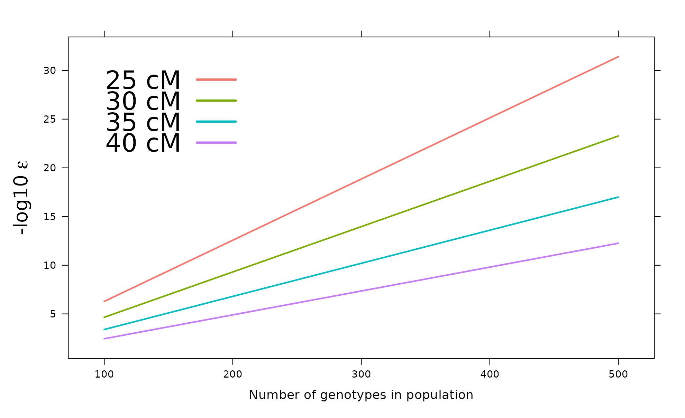
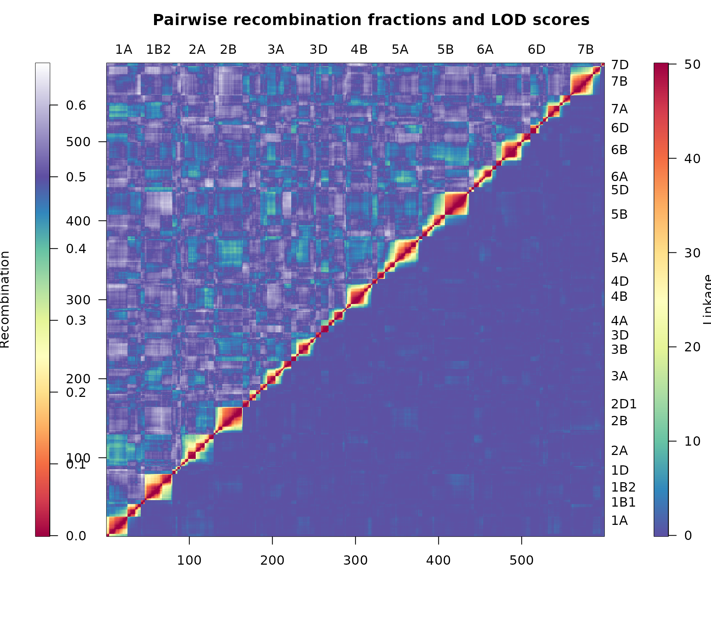

# Getting started with ASMap

This article constructs a linkage map from a set of unordered marker
scores, discusses the single argument that most influences the outcome,
and indicates how the resulting map may be assessed. It is intended as
an entry point to the remaining documentation.

Construction is performed by the MSTmap algorithm ([Wu
2008](#ref-mst08)), which clusters markers into linkage groups and
determines an optimal order within each group in a single pass. This is
in contrast to the two-stage procedures common elsewhere, in which an
initial non-exhaustive ordering is followed by an exhaustive search
within a sliding marker window.

## Installation

``` r

install.packages("ASMap")

# development version
# install.packages("devtools")
devtools::install_github("DrJ001/ASMap")
```

## Construction from a set of marker scores

`mapDHf` is an unconstructed doubled haploid wheat marker set, supplied
in the layout the construction function requires: **markers in rows,
genotypes in columns**, with marker names held in the `rownames` and
genotype names in the `names`.

> The package datasets are not lazy-loaded, and therefore require an
> explicit [`data()`](https://rdrr.io/r/utils/data.html) call. Its
> omission results in `object 'mapDHf' not found`.

``` r

library(ASMap)
data(mapDHf)

dim(mapDHf)
```

    [1] 599 218

``` r

mapDHf[1:5, 1:6]
```

            DH1 DH2 DH3 DH4 DH5 DH6
    5B.m.2    B   B   B   A   A   B
    5A.m.52   B   B   A   A   B   A
    2B.m.1    A   B   A   B   B   A
    6B.m.3    B   B   A   B   A   A
    5A.m.43   B   B   A   B   B   A

A single call clusters the markers into linkage groups, orders the
markers within each group and estimates the genetic distances between
them.

``` r

map <- mstmap(mapDHf, pop.type = "DH", dist.fun = "kosambi", p.value = 1e-06)
```

    Number of linkage groups: 24
    The size of the linkage groups are: 56  54  35  41  4   37  6   30  40  27  37  13  15  10  21  6   32  33  33  41  6   9   5   8   
    The number of bins in each linkage group: 55    53  34  41  3   36  6   29  40  27  36  13  14  9   21  5   32  33  32  41  5   8   4   7   

``` r

nchr(map)
```

    [1] 24

``` r

round(chrlen(map), 1)
```

       L1    L2    L3    L4    L5    L6    L7    L8    L9   L10   L11   L12   L13 
    142.8 181.9  97.4 115.4  21.7 108.2  13.3 133.9 153.2  98.7 145.8  60.4  72.2 
      L14   L15   L16   L17   L18   L19   L20   L21   L22   L23   L24 
     81.2  98.2   8.7 109.5  60.9 134.5 104.0  18.0   7.8   7.8  19.2 

The value returned is an R/qtl `cross` object, so the facilities of the
[qtl](https://CRAN.R-project.org/package=qtl) package ([Broman and Wu
2014](#ref-br14)) are immediately available for further examination of
the map.

``` r

summary(map)
```

    Warning in summary.cross(map): Some markers at the same position on chr
    L1,L2,L3,L5,L6,L8,L11,L13,L14,L16,L19,L21,L22,L23,L24; use jittermap().

        Doubled haploids

        No. individuals:    218 

        No. phenotypes:     1 
        Percent phenotyped: 100 

        No. chromosomes:    24 
            Autosomes:      L1 L2 L3 L4 L5 L6 L7 L8 L9 L10 L11 L12 L13 L14 L15 L16 
                            L17 L18 L19 L20 L21 L22 L23 L24 

        Total markers:      599 
        No. markers:        56 54 35 41 4 37 6 30 40 27 37 13 15 10 21 6 32 33 33 41 
                            6 9 5 8 
        Percent genotyped:  99.8 
        Genotypes (%):      AA:51.2  BB:48.8 

``` r

plotMap(map)
```


## Construction from an existing cross object

Where the markers already reside in a `cross` object, the same generic
accepts it directly. Setting `bychr = FALSE` combines all markers and
reconstructs the map in its entirety, disregarding the existing linkage
groups.

``` r

data(mapDH)
map2 <- mstmap(mapDH, bychr = FALSE, dist.fun = "kosambi", p.value = 1e-06)
```

    Number of linkage groups: 24
    The size of the linkage groups are: 41  5   33  10  40  35  8   13  37  30  6   9   21  32  6   54  56  6   27  41  15  33  37  4   
    The number of bins in each linkage group: 41    4   33  9   40  34  7   13  36  29  5   8   21  32  6   53  55  5   27  41  14  32  36  3   

``` r

nchr(map2)
```

    [1] 24

Setting `bychr = TRUE` instead retains the existing groups and re-orders
the markers within them. Two combinations of arguments are used
repeatedly throughout this documentation:

``` r

# cluster and order from scratch, disregarding existing linkage groups
mstmap(cross, bychr = FALSE, p.value = 1e-12)

# re-order within existing linkage groups, without splitting them
mstmap(cross, bychr = TRUE, p.value = 2)
```

A `p.value` greater than unity suppresses clustering entirely, which is
the mechanism underlying the second of these.

## The choice of `p.value`

The `p.value` argument determines the threshold at which markers are
separated into distinct linkage groups. Its appropriate value depends
strongly upon the size of the population, larger populations requiring a
smaller value, and some experimentation is generally necessary. The
relationship may be examined directly with
[`pValue()`](https://drj001.github.io/ASMap/reference/pValue.md), which
permits the choice to be made on a considered basis.

``` r

pValue(dist = c(25, 30, 35, 40), pop.size = 100:500, map.function = "kosambi")
```



For a population of approximately 300 individuals, a `p.value` of
`1e-12` corresponds to a threshold of some 30 cM before markers are
assigned to a common linkage group.

## Assessment of the constructed map

[`heatMap()`](https://drj001.github.io/ASMap/reference/heatMap.md)
displays the pairwise estimated recombination fractions and the pairwise
LOD scores of linkage together, each with its own legend. Consistent
heat within a linkage group indicates strong linkage between
neighbouring markers, and blocks of shared heat between groups suggest
groups that may require merging.

``` r

heatMap(mapDH, lmax = 50)
```



## Further reading

| Article | Subject |
|----|----|
| [How the MSTmap algorithm works](https://drj001.github.io/ASMap/articles/mstmap-algorithm.md) | The minimum spanning tree formulation, clustering and marker ordering |
| [Constructing a linkage map](https://drj001.github.io/ASMap/articles/constructing-a-map.md) | Both construction functions and the MSTmap parameters |
| [Pulling and pushing markers](https://drj001.github.io/ASMap/articles/pulling-and-pushing.md) | Setting problematic markers aside and reintroducing them |
| [Diagnosing genotypes and markers](https://drj001.github.io/ASMap/articles/diagnostics.md) | Profiling of individuals, markers and intervals; genetic clones |
| [Heat maps](https://drj001.github.io/ASMap/articles/heat-maps.md) | Interpretation and tuning of the recombination fraction and LOD display |
| [Manipulating linkage maps](https://drj001.github.io/ASMap/articles/manipulating-maps.md) | Breaking, merging, subsetting and combining maps |
| [Worked example I: construction](https://drj001.github.io/ASMap/articles/worked-example-construction.md) | A barley backcross, from raw markers to a constructed map |
| [Worked example II: refinement](https://drj001.github.io/ASMap/articles/worked-example-refinement.md) | Reintroduction of markers, merging of groups, fine mapping |
| [Notes on the MSTmap algorithm](https://drj001.github.io/ASMap/articles/algorithm-notes.md) | Distance calculations, `mvest.bc` and `detectBadData` |

The package should be cited in published work as Taylor and Butler
([2017](#ref-tb17)); `citation("ASMap")` gives the current entry.

## References

Broman, K. W, and H Wu. 2014. *: Tools for Analayzing QTL Experiments*.
<http://www.CRAN.R-project.org/src/contrib/Archive/qtl/>.

Taylor, Julian, and David Butler. 2017. “R Package ASMap: Efficient
Genetic Linkage Map Construction and Diagnosis.” *Journal of Statistical
Software* 79 (6): 1–29. <https://doi.org/10.18637/jss.v079.i06>.

Wu, Prasanna R. AND Close, Yonghui AND Bhat. 2008. “Efficient and
Accurate Construction of Genetic Linkage Maps from the Minimum Spanning
Tree of a Graph.” *PLoS Genetics* 4 (10).
<https://doi.org/10.1371/journal.pgen.1000212>.
